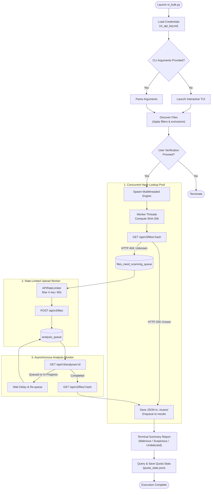

<div align="center">

```text
 /$$    /$$ /$$$$$$$$      /$$$$$$$  /$$   /$$ /$$       /$$   /$$      
| $$   | $$|__  $$__/     | $$__  $$| $$  | $$| $$      | $$  /$$/      
| $$   | $$   | $$        | $$  \ $$| $$  | $$| $$      | $$ /$$/       
|  $$ / $$/   | $$ /$$$$$$| $$$$$$$ | $$  | $$| $$      | $$$$$/        
 \  $$ $$/    | $$|______/| $$__  $$| $$  | $$| $$      | $$  $$        
  \  $$$/     | $$        | $$  \ $$| $$  | $$| $$      | $$  $$       
   \  $/      | $$        | $$$$$$$/|  $$$$$$/| $$$$$$$$| $$ \  $$      
    \_/       |__/        |_______/  \______/ |________/|__/  \__/      
```

# VirusTotal Simple Bulk Scanner (VT-Bulk)

**A high-efficiency, multi-threaded command-line scanner for bulk file verification against the VirusTotal v3 API.**

[](https://www.python.org/)
[](https://developers.virustotal.com/reference/overview)
[](LICENSE)
[](changelog)
[](https://github.com/antoniomarinb/Virus-Total-Simple-Bulk-Scanner)

</div>

---

## ⚡ Overview

When auditing large software directories, downloaded artifacts, or suspicious file drops, you need a tool that is fast, transparent, and respects API constraints.

**VT-Bulk** is a lightweight Python utility adhering to the Unix philosophy: do one thing and do it well. Instead of blindly uploading hundreds of files and exhausting your API limits within seconds, **VT-Bulk** checks existing file intelligence first via SHA-256 hash queries, uploads only unknown files through an asynchronous rate-limited pipeline, and provides clean summarized reports and raw JSON artifacts.

---

## ✨ Key Capabilities

- 🚀 **Hash-First Query Engine**: Calculates local cryptographic hashes (SHA-256) and probes VirusTotal's cache first. Files already cataloged are diagnosed in milliseconds without consuming upload bandwidth.
- 🧵 **Multi-Threaded Parallel Lookups**: Spawns concurrent worker threads across the target directory, accelerating batch triage significantly.
- ⏱️ **Smart API Rate Limiting**: Built-in sliding-window limiter (`APIRateLimiter`) strictly respects the free-tier quota (4 uploads/minute), avoiding HTTP 429 quota exhaustion.
- 🔄 **Asynchronous Analysis Polling**: Files requiring fresh analysis are uploaded in the background while an asynchronous loop polls their completion status.
- 📂 **Recursive Tree Traversal**: Scans arbitrary folder hierarchies with flexible file extension filtering (e.g., `.exe`, `.dll`, `.bin`).
- 🛡️ **Safe & Transparent Operation**: Displays a classified breakdown of all candidate files and prompts for user confirmation before initiating any remote network requests. Sensitive files (such as `vt_api_key.txt`) are automatically protected.
- 💾 **Structured Data Persistence**: Saves complete VirusTotal v3 JSON reports to `./scans/<filename>-<hash>.analysis.json` and records daily API quota metrics in `quota_stats.json`.
- 🖥️ **Dual Execution Modes**: Seamlessly switch between an interactive step-by-step TUI wizard and headless CLI arguments suitable for scripts and pipelines.

---

## 🏗️ Architecture & Pipeline

VT-Bulk is engineered around a decoupled producer-consumer architecture using thread-safe queues:



### Core Architecture Components

| Component | Role | Description |
| :--- | :--- | :--- |
| [`APIRateLimiter`](file:///home/fedora/Workspaces/PyCharmMiscProject/Virus-Total-Simple-Bulk-Scanner/vt_bulk.py#L175-L191) | Traffic Controller | Manages a sliding queue of request timestamps to strictly throttle uploads to 4 requests per 60 seconds. |
| [`multithread_GetFileResults`](file:///home/fedora/Workspaces/PyCharmMiscProject/Virus-Total-Simple-Bulk-Scanner/vt_bulk.py#L120-L136) | Hash Prober | Concurrently hashes files and inspects VirusTotal cache via `GET /api/v3/files/{hash}`. |
| [`requestedAnalysisWorker`](file:///home/fedora/Workspaces/PyCharmMiscProject/Virus-Total-Simple-Bulk-Scanner/vt_bulk.py#L192-L217) | Background Uploader | Listens on `files_need_scanning_queue` to upload unknown samples through the rate limiter without freezing the main thread. |
| [`getQueuedScansResultsV2`](file:///home/fedora/Workspaces/PyCharmMiscProject/Virus-Total-Simple-Bulk-Scanner/vt_bulk.py#L93-L119) | Analysis Poller | Polls pending analyses until marked `completed`, then delegates to fetch and store final verdicts. |
| [`createAnalysisFile`](file:///home/fedora/Workspaces/PyCharmMiscProject/Virus-Total-Simple-Bulk-Scanner/vt_bulk.py#L336-L345) | JSON Sink | Formats and persists full analysis metadata into the `./scans/` directory for offline ingestion or SIEM analysis. |

---

## 🚀 Quick Start

### 1. Prerequisites
- **Python 3.9+**
- **Requests**: VT-Bulk automatically detects and attempts to self-bootstrap `requests` if missing, or you can install it manually:

```bash
pip install requests
```

### 2. Clone the Repository
```bash
git clone https://github.com/antoniomarinb/Virus-Total-Simple-Bulk-Scanner.git
cd Virus-Total-Simple-Bulk-Scanner
```

### 3. API Key Setup
You need a VirusTotal API Key and your VirusTotal Username:
- **API Key**: Found at [virustotal.com/gui/my-apikey](https://www.virustotal.com/gui/my-apikey)
- **User ID**: Found on your profile page at [virustotal.com](https://www.virustotal.com)

You have two convenient options to configure credentials:
1. **Interactive Assistant (Automatic)**: Run `python vt_bulk.py` without a key file. The setup wizard will guide you through pasting your User ID and 64-character API key, creating `vt_api_key.txt` automatically.
2. **Manual Configuration**: Create a file named `vt_api_key.txt` in the root directory formatted as:
   ```text
   <YOUR_64_CHAR_VT_API_KEY>:<YOUR_VT_USER_ID>
   ```

---

## 📖 Usage & CLI Reference

### Command Syntax

```bash
python vt_bulk.py [PATH] [OPTIONS]
```

### Arguments & Flags

| Flag | Long Option | Description |
| :--- | :--- | :--- |
| `PATH` | *(positional)* | Directory path containing the target files to inspect. If omitted, launches the interactive prompt. |
| `-e` | `--extension` | Comma-separated list of extensions to filter by (e.g. `.exe,.dll` or `exe,dll`). |
| `-q` | `--quiet` | Suppresses verbose progress messages during scanning. |
| `-u` | `--unsafe-only` | *(Reserved for future release)* Filter output to only malicious/suspicious items. |
| `-f` | `--full-report` | *(Reserved for future release)* Display expanded engine-by-engine analysis details. |
| `-h` | `--help` | Display the CLI help message and exit. |

### Practical Examples

#### Interactive Mode (Wizard)
Simply run the script with no arguments to be prompted for directory, extensions, and JSON export preferences:
```bash
python vt_bulk.py
```

#### Scan a Specific Directory
```bash
python vt_bulk.py /path/to/suspect/samples
```

#### Filter by Extensions
Scan only executables and dynamic link libraries:
```bash
python vt_bulk.py ./downloads -e exe,dll
```

#### Headless Quiet Mode (Scripts / Automation)
```bash
python vt_bulk.py ./artifacts -e bin,elf -q
```

---

## 🧪 Safe Testing with EICAR

A test generation script [`genbadtests.sh`](file:///home/fedora/Workspaces/PyCharmMiscProject/Virus-Total-Simple-Bulk-Scanner/genbadtests.sh) is included in the repository. It generates benign [EICAR standard anti-virus test files](https://www.eicar.org/) inside a `randomtests/` directory:

```bash
# Generate safe synthetic test samples
chmod +x genbadtests.sh
./genbadtests.sh

# Run VT-Bulk against the generated test files
python vt_bulk.py ./randomtests
```

VT-Bulk will identify the malicious signatures and present a aggregated report:
```text
Total results: 
	Malicious: ['badFile', 'randomBadFile1', 'randomBadFile2', ...]
	Suspicious: []
	Undetected: []
```

---

## 📁 Output Artifacts

Running scans produces structured output files for auditing:

- **`./scans/<filename>-<sha256>.analysis.json`**: Full VirusTotal API v3 response containing individual engine detections, reputation scores, sandbox behavior tags, and metadata.
- **`quota_stats.json`**: Daily quota utilization snapshot retrieved directly from the `/api/v3/users/{id}/api_usage` endpoint, helping track remaining API calls.

---

## 🗺️ Roadmap

- [ ] Multi-hash cross-verification (MD5, SHA-1, SHA-256) to ensure collision prevention.
- [ ] Client-side local cache database to bypass queries for files inspected within the last $N$ days.
- [ ] Native URL bulk scanning module.
- [ ] Rich terminal UI with real-time live progress bars (`rich` / `curses`).
- [ ] Integration of `--unsafe-only` and `--full-report` flag filters.

---

## 👤 Author & Maintainer

- **Antonio Marín-Blázquez** — [GitHub (@antoniomarinb)](https://github.com/antoniomarinb)

---

## 📄 License

This project is licensed under the MIT License — see the [LICENSE](LICENSE) file for details.
